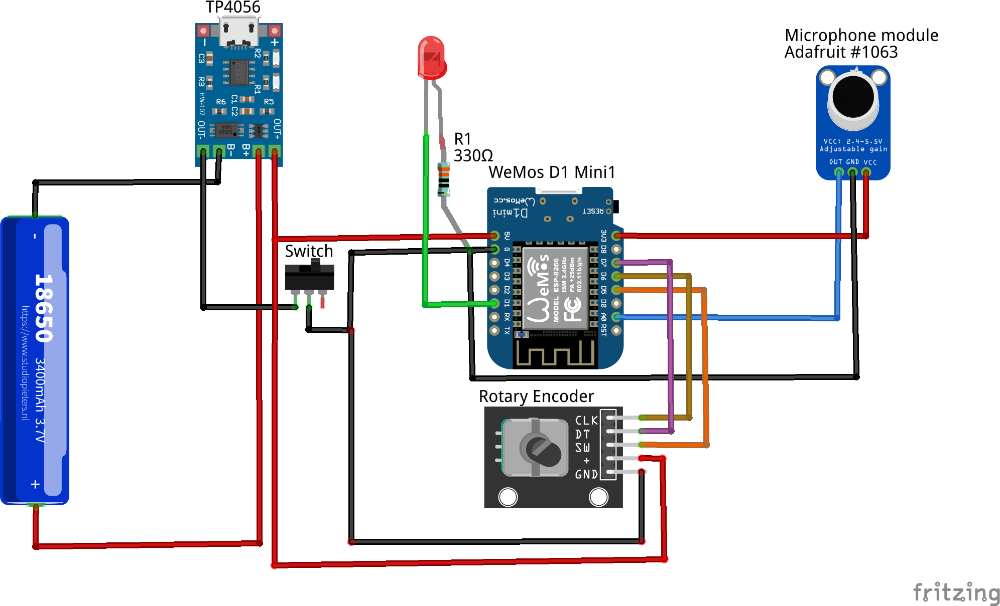
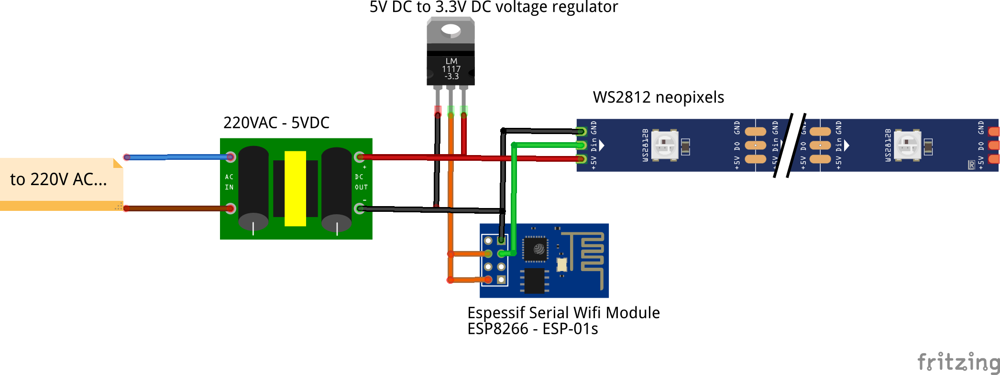

# electroPi modifications:
* modify the directory structure. Now each sub-project has it's own directories.
* added schematic diagram of each module
* updated the hardware for the master module
* updated the software for both master and slave modules.

## Master module schematic

----
## Slave module schematic

-----
#### led_master.ino:
- changed the hardware: added an LED and a rotary encoder instead of a simple button
	= the LED is used to display on the master module the slave's LED strips intensity (only when the rotary knob is rotated.)
	= the rotary knob is used to select the slave LED's intensity (rotating left right). Simple click of rotary encoder will send the current intensity to all slaves. Double click of the rotary encoder will change the display style (dynamic, slow, all white) of the slaves.
- main changes in software side:
	= added support for the rotary encoder and LED
	= added support for remote brightness control
	= hide the created WIFI SSID
	= changed individual master->slave messages to broadcast messages. master now doesn't really care how many slaves are in the network (at least one, and master will start sending audio data)
	= removed original button handling methods and implementation.
	
-----	
#### led_slave.ino:
- added support for brightness setting
- heartbeat is sent as broadcast message

------------------

# NaturalNerd's version:
### Brief explanation

*Remember to include reactive_common.h in the same directory as the .ino files, else inclusion will fail.*

#### led_master.ino is for the controller with the microphone module. Needs to specify:
* Button pin to change mode
* Microphone pin to read audio levels
* How many lamps will connect

#### led_slave.ino is for the lamps themselves. Needs to specify:
* The pin the LED strip is connected to
* The number of diodes on the strip
* Which unique ID the current lamp has. Starts from 1 to n, where n is the amount of lamps. Wont work unless this is correct, and the same as the amount of lamps the controller expects.
